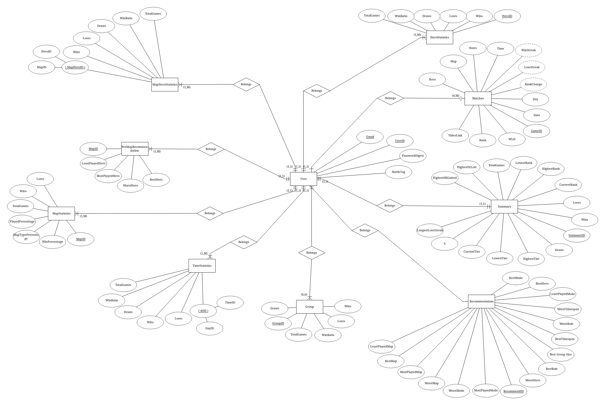
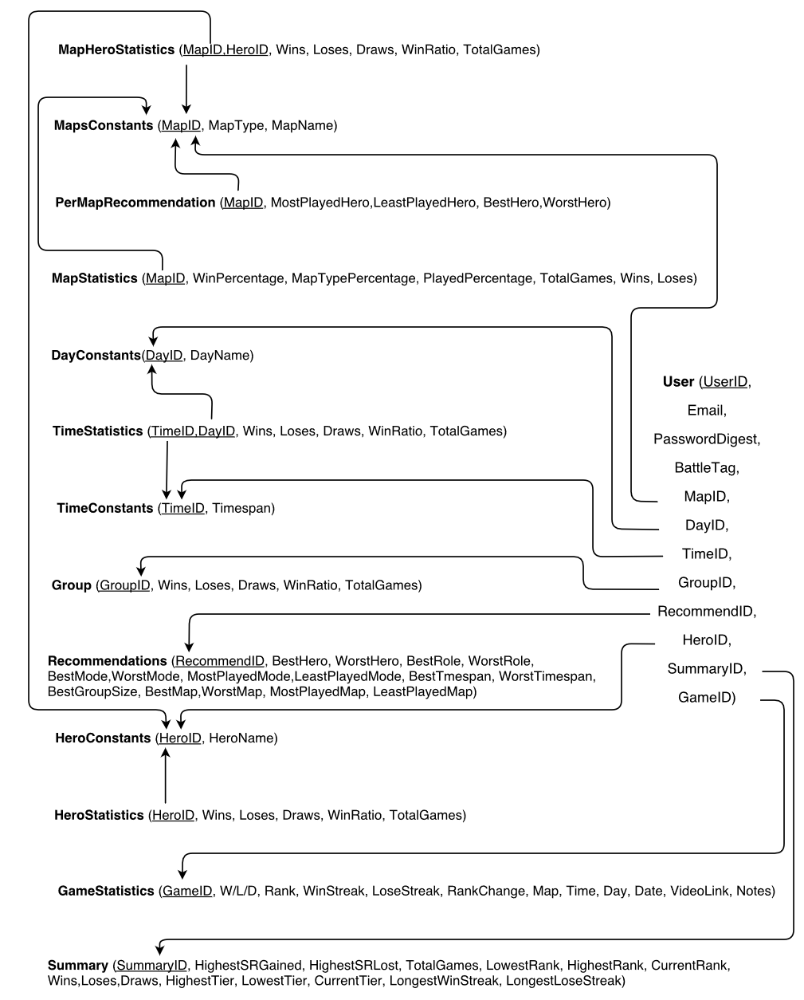

# OverTrack - Overwatch Performance Tracker
OverTrack is a web app made using rails. OverTrack helps the players of Overwatch to track their stats so that they can know their weaknesses and improve quickly.

## Demo
This project can be viewed at https://overtracker.herokuapp.com/ </br>
Alternatively, the repo can be cloned and launched locally using 
``` Rails server ```

## Screenshot
 </br>

## ERD Diagram
Entity Relationship diagram for this project showing all the tables and their respective attributes.
 </br>

## Relational Schema
The non-normalized schema is given below. The arrows denote the Foreign Key relations.

